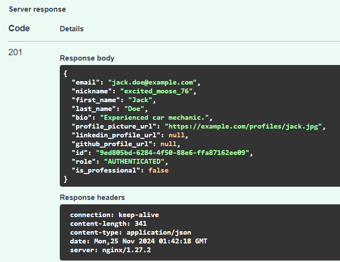

# Fixing Issue 1- Nickname Doesn't Match

When a new user was creating using POST in the API, the nickname given would be overwritten by a random one and saved to the Database.

Fixed issues in:
[`user_schemes.py`](https://github.com/digitalburritos/hw10_event_manager/blob/1-nickname-doesnt-match/app/schemas/user_schemas.py#L39-L50) [`user_service.py`](https://github.com/digitalburritos/hw10_event_manager/blob/1-nickname-doesnt-match/app/services/user_service.py#L51-L82) 

In previous iterations, a random nickname was generated even when a nickname was provided during the Create action.

Added logic to correctly handle the provided nickname when creating a new user.

 