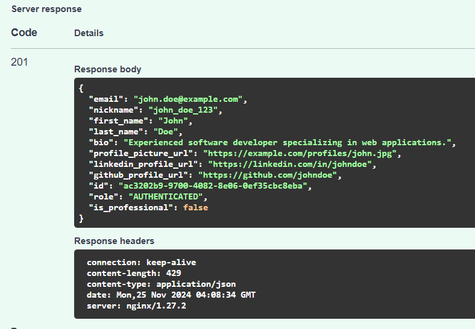

# Fixing Issue 2- Null URLs

### [user_routes.py](https://github.com/digitalburritos/hw10_event_manager/blob/2-null-urls/app/routers/user_routes.py#L150-L166)

- Updated the user creation response to include the LinkedIn and GitHub profile URLs. Now, when a new user is created, the response will return these URLs along with the other user details.
  
### [user_schemas.py](https://github.com/digitalburritos/hw10_event_manager/blob/2-null-urls/app/schemas/user_schemas.py#L24-L54)
- Added custom validation functions for LinkedIn and GitHub profile URLs:
  - The validation for LinkedIn is done through the linkedin_validate_url function, ensuring the URL equals the secure hypertext transfer protocol format: linkedin.com/in/username
  - The validation for GitHub is done through the github_validate_url function, ensuring the URL equals the secure hypertext transfer protocol format: github.com/username

